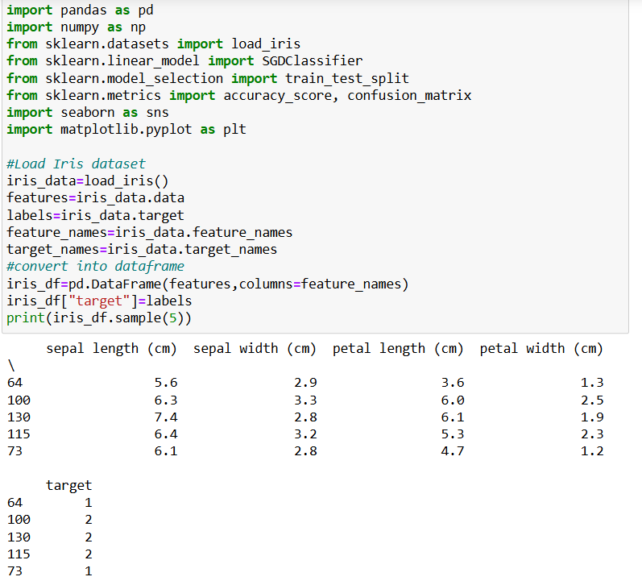

# SGD-Classifier
## AIM:
To write a program to predict the type of species of the Iris flower using the SGD Classifier.

## Equipments Required:
1. Hardware – PCs
2. Anaconda – Python 3.7 Installation / Jupyter notebook

## Algorithm
1. Import required libraries.
2. Load the Iris dataset.
3. Convert it into a DataFrame
4. Split data into x(features) and y(target)
5. Split into training and testing sets.
6. Create ab SGD Classifier
7. Train the model
8. Make predictions.
9. Check accuracy.
10. Show confusion matrix.

## Program:
```
Program to implement the prediction of iris species using SGD Classifier.
Developed by: PRAGATHI KUMAR
RegisterNumber:  212224230200
```
```
import pandas as pd
import numpy as np
from sklearn.datasets import load_iris
from sklearn.linear_model import SGDClassifier
from sklearn.model_selection import train_test_split
from sklearn.metrics import accuracy_score, confusion_matrix
import seaborn as sns
import matplotlib.pyplot as plt

#Load Iris dataset
iris_data=load_iris()
features=iris_data.data
labels=iris_data.target
feature_names=iris_data.feature_names
target_names=iris_data.target_names

#convert into dataframe
iris_df=pd.DataFrame(features,columns=feature_names)
iris_df["target"]=labels

print(iris_df.sample(5))

#Feature and label separation
x=iris_df[feature_names]
y=iris_df["target"]

#Train-test split
x_train,x_test,y_train,y_test=train_test_split(x,y,test_size=0.2,random_state=42)

#Initialize and train SGD classifier
model=SGDClassifier(max_iter=1000,tol=1e-3,random_state=42)
model.fit(x_train,y_train)

#Predict on test set
predictions=model.predict(x_test)

#Accuracy
acc=accuracy_score(y_test,predictions)
print(f"Model Accuracy: {acc :. 3f}")

#confusion matrix
conf_matrix=confusion_matrix(y_test,predictions)
print("Confusion Matrix:")
print(conf_matrix)

plt.figure(figsize=(6, 4))
sns.heatmap(conf_matrix,annot=True,cmap="YlGnBu",fmt='d',xticklabels=target_names,yticklabels=target_names)
plt.title("SGD Classifier - Confusion Matrix")
plt.xlabel("Predicted")
plt.ylabel("Actual")
plt.tight_layout()
plt.show()
```

## Output:



## Result:
Thus, the program to implement the prediction of the Iris species using SGD Classifier is written and verified using Python programming.
